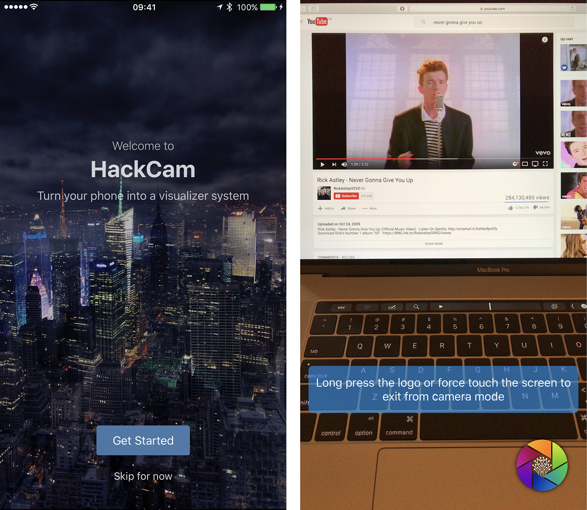

# HackCam

HackCam - Turns your phone into a visualizer system.

Want to use your iPhone as a video camera and project the real-time image to your screen? You just need a Mac, an iPhone, a cable, and HackCam. HackCam is perfect for recording and mirroring what the iPhone camera captures. Also, you can put your own logo on the bottom right corner.

By tapping the logo, the whole camera view will be blurred just in case you would like to "mute the screen". Your logo will shown right in the middle. It is perfect for use cases like a conferences and presentations.

HackCam was inspired by members of KCL Tech Society at King's College London. The app was developed during the preparation of HackLondon, the most anticipated student hackathon in UK and EU. HackLondon adopted the app and used it as a "connector" between presenters' laptops/devices and the projector screen. So devices did not have to be connected and disconnected back and forth.

